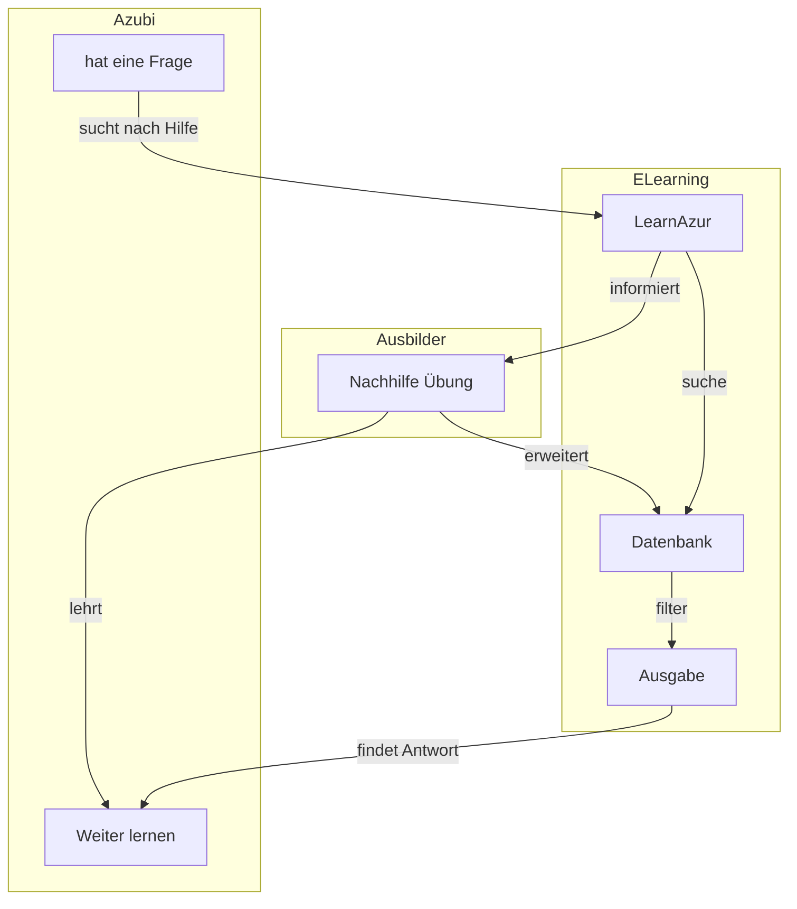

# LearnAzur
Ziel ist es ein Online Lernportal zu erstellen. Darauf sollen Experten ihre Inhalte für die Ausbildung hinterlegen und die Azubis der Hochschule lernen.

## Beschreibung

## Milestones

## Members
* Adrian
* Aischa
* Dominik
* Mehindi
* Samet
* Leon
* Yassine
* Marvyn
***
## Webseiten
Jira: https://learn-azur.swift-jira.net/secure/RapidBoard.jspa?rapidView=1&projectKey=TEAM&view=detail&selectedIssue=TEAM-4
Discord: https://discord.gg/G3VrWkZD 

## Architektur

