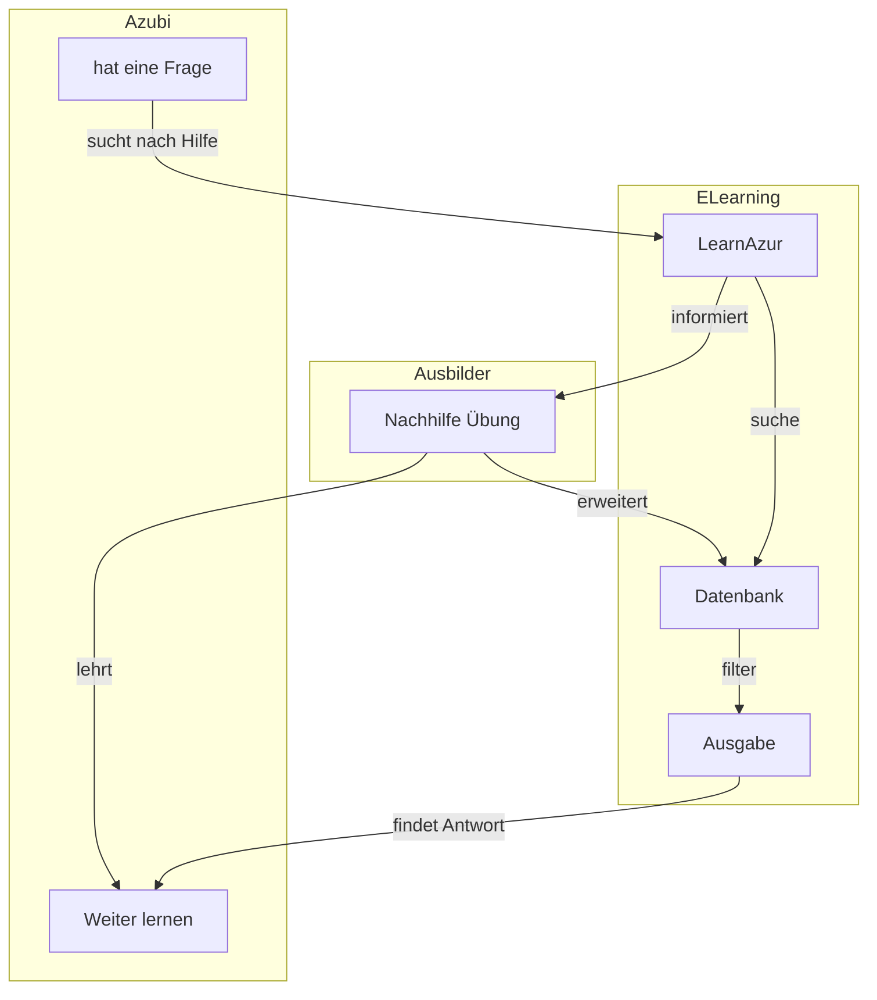

# LearnAzur
Ziel ist es ein Online Lernportal zu erstellen. Darauf sollen Experten ihre Inhalte für die Ausbildung hinterlegen und die Azubis der Hochschule lernen.

## Beschreibung

```mermaid
graph TB
  subgraph "ELearning"
  Tool -- suche --> Datenbank[Datenbank]
  Datenbank -- filter --> Ausgabe[Ausgabe]
  end

  subgraph "Ausbilder"
  Übung -- erweitert --> Datenbank
  end

  subgraph "Azubi"
  Frage[hat eine Frage] -- sucht nach Hilfe --> Tool[LearnAzur]
  Tool -- informiert --> Übung[Nachhilfe Übung]
  Übung -- lehrt --> Antwort
  Ausgabe -- findet Antwort --> Antwort[Weiter lernen]
end
```
